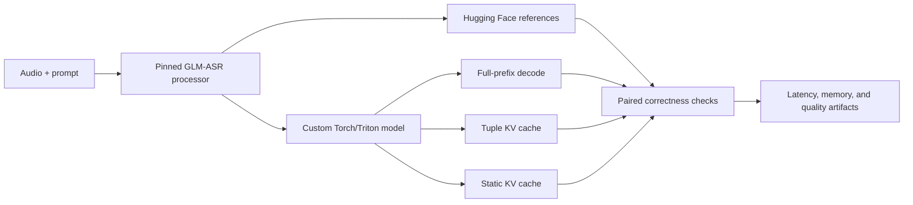

# Faster GLM-ASR

[](https://github.com/Firefly0237/faster-glm-asr/actions/workflows/ci.yml)
[](https://www.python.org/)
[](LICENSE)

A PyTorch/Triton inference path and reproducible benchmark suite for
[`zai-org/GLM-ASR-Nano-2512`](https://huggingface.co/zai-org/GLM-ASR-Nano-2512).

Faster GLM-ASR focuses on the autoregressive decode path: loading the pinned
official checkpoint into a custom model, making KV-cache behavior explicit, and
comparing alternative generation strategies under the same inputs and
measurement conditions. The goal is to study latency and GPU-memory efficiency
without changing the generated sequence.

The repository also includes long-audio preparation and evaluation utilities,
machine-readable benchmark artifacts, and a separate single-node distributed
training experiment for studying DDP systems behavior.

## Highlights

- A custom GLM-ASR model graph with strict loading for the pinned Transformers
  checkpoint and processor.
- Six named inference paths covering Hugging Face references, full-prefix
  decoding, dynamic tuple caches, and preallocated static caches.
- Torch reference implementations and Triton kernels for selected model
  operations.
- Paired correctness checks for prepared inputs, generated token IDs, and decoded
  hypotheses.
- Separate latency, memory, diagnostic-phase, and profiler runs to keep primary
  timing free from instrumentation overhead.
- Deterministic audio manifests, long-recording segmentation and stitching, and
  WER/CER evaluation.
- Reproducible environment, model, source, and input fingerprints in benchmark
  artifacts.

## Quick start

The single-file CLI runs greedy transcription on one NVIDIA GPU. Start from a
Linux environment with Python 3.11 or 3.12 and a CUDA-compatible driver:

```bash
git clone https://github.com/Firefly0237/faster-glm-asr.git
cd faster-glm-asr
python3.11 -m venv .venv
source .venv/bin/activate
python -m pip install --upgrade pip "setuptools>=77" wheel
python -m pip install --no-build-isolation -e ".[gpu]"
```

Download the pinned model snapshot once. Inference uses this local directory
without a network fallback:

```bash
MODEL_DIR=artifacts/private/cache/model/glm-asr-nano-2512
hf download zai-org/GLM-ASR-Nano-2512 \
  --revision 61ba4e0b3309b6656edea3e93e419f7bd5c61957 \
  --local-dir "$MODEL_DIR"
```

Transcribe a WAV file with the static KV-cache path:

```bash
faster-glm-asr-transcribe path/to/sample.wav \
  --model "$MODEL_DIR" \
  --implementation custom-static-cache
```

The command prints the transcript. Add `--json` to include the implementation,
audio duration, generated-token count, and token IDs. The same interface also
offers `hf-cached`, `custom-greedy-full-prefix`, and `custom-tuple-cache` for
quick functional comparisons:

```bash
faster-glm-asr-transcribe path/to/sample.wav \
  --model "$MODEL_DIR" \
  --implementation hf-cached \
  --json
```

For controlled performance measurements, use the pinned environment and matrix
workflow in the [reproducibility guide](docs/reproducibility.md).

## Architecture

The runtime separates model semantics, generation policy, and measurement. This
keeps cache implementations independently testable and makes paired comparisons
easier to reproduce.



The processor produces audio features, masks, and prompt tokens. The custom
runtime applies the audio encoder and projector, merges the projected audio with
text embeddings, and performs greedy autoregressive decoding through the text
decoder. See the [architecture guide](docs/architecture.md) for module boundaries
and the complete runtime data flow.

## Inference paths

| Implementation | Runtime | Prefix policy | KV storage |
|---|---|---|---|
| `hf_cached` | Transformers reference | Prefill once, then decode one token at a time | Framework cache |
| `hf_no_cache` | Transformers reference | Recompute the growing prefix | None |
| `custom_full_prefix` | Custom model | Recompute the growing prefix | None |
| `custom_greedy_full_prefix` | Custom model | Full-prefix decode with deterministic argmax | None |
| `custom_tuple_cache` | Custom model | Prefill once, then decode one token at a time | Per-layer tuple concatenation |
| `custom_static_cache` | Custom model | Prefill once, then decode one token at a time | Preallocated per-layer buffers |

The tuple and static paths share last-position logit projection and preallocated
token output. Their primary implementation difference is dynamic KV growth
versus in-place cache writes. `hf_no_cache` is a controlled ablation;
`hf_cached` is the standard cached reference. The custom runtime currently
targets single-request greedy decoding in FP32, with dense per-request storage
for the static cache.

## Benchmarking

The benchmark matrix runs paired implementations over identical prepared inputs,
generation settings, model bytes, and software environments. It records:

- median and p95 request latency;
- real-time factor for speech workloads;
- framework allocator peaks and sampled process GPU memory;
- diagnostic CUDA-event phases and profiler metadata in separate runs;
- token and decoded-text parity between paired paths;
- WER/CER after source-level stitching for long audio.

Target-GPU result tables will be added with their reproducibility artifacts after
the first complete benchmark run. The
[benchmark contract](docs/benchmark-contract.md) defines comparison rules and
metric boundaries, while the [reproducibility guide](docs/reproducibility.md)
covers data preparation, execution, aggregation, and artifact validation.

## Repository layout

```text
faster-glm-asr/
├── src/faster_glm_asr/
│   ├── modeling/          # Model graph, generation, and checkpoint loading
│   ├── kernels/           # Torch implementations and Triton kernels
│   ├── benchmarking/      # Runners, comparisons, matrices, and artifacts
│   └── data/              # Audio manifests, segmentation, and stitching
├── experiments/               # Standalone distributed-training experiments
├── configs/                   # Benchmark, data, environment, and training configs
├── docs/                      # Architecture and reproducibility guides
├── tests/                     # Unit, integration, and contract tests
└── tools/                     # Environment, data, and release utilities
```

## Documentation

| Guide | Contents |
|---|---|
| [Architecture](docs/architecture.md) | Runtime data flow, package boundaries, and cache policies |
| [Benchmark contract](docs/benchmark-contract.md) | Comparison rules, measurement profiles, and metrics |
| [Reproducibility](docs/reproducibility.md) | End-to-end benchmark preparation and execution |
| [RTX 3090 environment](docs/rtx3090-environment.md) | Four-GPU environment setup and acceptance checks |
| [Distributed training](docs/distributed-training.md) | Single-node DDP scaling, replay, and profiling experiment |
| [Provenance](docs/provenance.md) | Upstream sources, licenses, and adaptation records |
| [Documentation index](docs/README.md) | Complete guide index |

## Distributed-training experiment

`experiments/distributed_training/` contains a self-contained decoder experiment
for measuring single-node DDP scaling at world sizes 1, 2, and 4. It includes a
fixed global-token workload, BF16 autocast, checkpoint replay, trajectory checks,
and an isolated profiler run. Its configuration and execution workflow are
documented in [Distributed training](docs/distributed-training.md).

## Development

The CPU test suite covers model and cache invariants, checkpoint mapping,
deterministic data transforms, benchmark schemas, and CLI contracts. From a
configured development environment, run:

```bash
python -m pytest
python -m ruff check .
python -m build --no-isolation
```

Python 3.11 and 3.12 are exercised in CI. GPU execution uses the pinned CUDA
environment described in [RTX 3090 environment](docs/rtx3090-environment.md).

## Contributing

Contributions to model compatibility, cache correctness, kernels, benchmarking,
and audio tooling are welcome. See [CONTRIBUTING.md](CONTRIBUTING.md) for the
development workflow, validation requirements, and provenance guidelines. Bug
reports and feature proposals can be opened through
[GitHub Issues](https://github.com/Firefly0237/faster-glm-asr/issues). Please use
the process in [SECURITY.md](SECURITY.md) for security reports.

## Acknowledgments

Faster GLM-ASR builds on the official GLM-ASR model interfaces and Hugging Face
Transformers compatibility behavior. Adapted components, upstream revisions,
datasets, and their licenses are recorded in [NOTICE](NOTICE) and the
[provenance guide](docs/provenance.md).

## License

Project-authored source is licensed under the
[Apache License 2.0](LICENSE). Model weights, datasets, and third-party
components retain their respective licenses; see [NOTICE](NOTICE).
