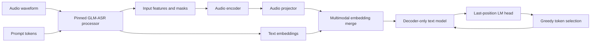

# Architecture

Faster GLM-ASR separates model semantics from generation policy and from
measurement. This makes it possible to change one part of the decode path while
holding the processor, model revision, generated tokens, and benchmark boundary
constant.

## Runtime data flow



The processor owns feature extraction and the placement of audio placeholder
tokens. The custom model validates the placeholder count and attention-mask
shape before it replaces those token embeddings with projected audio features.
Generation starts only after this multimodal prefix has been constructed.

## Package boundaries

| Package | Responsibility | Must not own |
|---|---|---|
| `modeling` | GLM-ASR configuration, module graph, weight loading, and generation APIs | benchmark aggregation or public-result policy |
| `kernels` | Torch fallbacks and opt-in Triton implementations | model downloads or experiment defaults |
| `benchmarking` | named runners, measurement profiles, comparison gates, and artifacts | private audio or hard-coded host paths |
| `data` | manifests, deterministic segmentation, public-dataset preparation, and stitching | model execution or performance claims |

The public model entry point is:

```python
from faster_glm_asr.modeling import load_model_from_hf
```

The loader requires an immutable model revision and returns the custom model
with the matching processor. For a local snapshot, the revision string alone
does not prove which bytes are on disk: formal runs therefore verify every file
against an external SHA-256 manifest before loading. Model files remain in an
ignored external cache or artifact root and are never copied into Git.

## Generation policies

The benchmark names cache behavior explicitly:

| Implementation | Model | Prefix policy | KV storage |
|---|---|---|---|
| `hf_cached` | Transformers reference | prefill once, then one token | framework cache |
| `hf_no_cache` | Transformers reference | recompute the growing prefix | none |
| `custom_full_prefix` | custom model | recompute the growing prefix | none |
| `custom_greedy_full_prefix` | custom model | recompute with deterministic argmax selection | none |
| `custom_tuple_cache` | custom model | prefill once, then one token | per-layer tuple concatenation |
| `custom_static_cache` | custom model | prefill once, then one token | preallocated per-layer buffers |

`hf_no_cache` is an ablation; it is not a description of the default
Transformers implementation. The tuple and static paths both project logits
from the last hidden position and preallocate token output, so their intended
difference is KV-cache growth versus in-place writes. Any target-GPU result must
still demonstrate that the implementation and profiler traces preserve this
isolation.

## Measurement profiles

One run has exactly one measurement profile:

- `canonical_latency` excludes NVML polling and phase instrumentation;
- `request_memory` samples process memory and reports the observed peak as a
  lower bound;
- `diagnostic_phase` uses CUDA events to inspect internal phases;
- profiler runs are separate experiments and are never substituted for
  uninstrumented latency.

Formal comparisons require identical prepared-input fingerprints and exact
generated token IDs. Quality metrics remain a separate gate: token equality on
a small input set does not establish WER on a speech corpus.

## Deliberate limits

The static cache is a dense, single-request prototype. It is not a paged cache,
continuous-batching scheduler, or production serving lifecycle. Its raw buffer
API assumes the caller advances `cache_pos` sequentially; the bundled generation
path owns that cursor, while arbitrary external buffer mutation is outside the
formal benchmark contract. Long recordings are segmented outside the timed
model request and scored after source-level stitching. Distributed decoder
training, if included under `experiments/`, is an isolated systems experiment
and is not part of the GLM-ASR inference graph.
